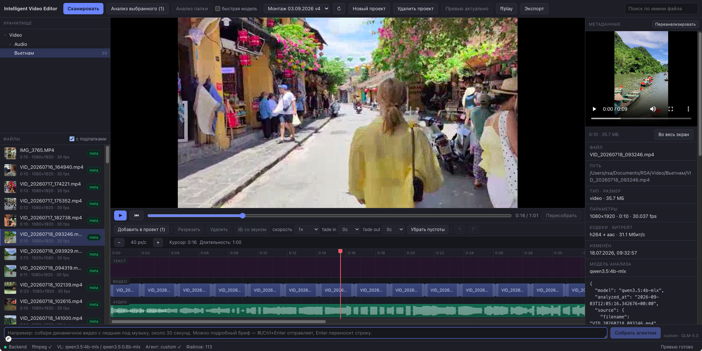

# Intelligent Video Editor

**[English](README.md) | Русский**

Десктопное приложение для чернового видеомонтажа: локальный семантический анализ
медиатеки через Qwen2.5-VL, таймлайн-редактор, предпросмотр и экспорт через ffmpeg,
плюс LLM-агент, который собирает монтаж по текстовому запросу («сделай динамичный ролик
на минуту из кадров с морем под этот трек»).

Всё, что касается содержимого медиатеки, считается **локально**: описания кадров,
объекты и сцены с таймкодами, темп и тактовая сетка музыки. Наружу уходит только текст
запроса к монтажному агенту — и то лишь если агентом пользуются.



## Возможности

- **Индексация хранилища** — рекурсивный инкрементальный скан, характеристики файлов
  через ffprobe, миниатюры, пометка повреждённых файлов.
- **Анализ медиа через Qwen2.5-VL** (локально, Ollama) — описание, объекты, стиль,
  настроение; для видео — сцены с таймкодами, по которым можно выбрать нужный фрагмент
  внутри длинного файла. Очередь с прогрессом, отменой и быстрым режимом на модели
  поменьше.
- **Разметка аудио** — темп, доли и такты (`beat_times`, `downbeats`), паузы и всплески
  громкости. Считается один раз при анализе, поэтому трек можно отбирать по темпу.
- **Таймлайн-редактор** — три дорожки (видео, аудио, текст), добавление, перемещение,
  обрезка, разрезание, скорость, fade, mute, переходы (crossfade / dip to black),
  текстовые слои, отмена и повтор.
- **Предпросмотр** — прокси-рендер 640×360 с кешем и встроенным плеером; при желании
  отдельное окно ffplay.
- **Экспорт** — MP4/H.264 (CRF 18/23/28 или битрейт), MOV/ProRes, WebM/VP9; прогресс с
  оценкой времени, отмена, проверка свободного места.
- **Агент-монтажёр** — собирает черновой монтаж по текстовому запросу через внешнюю
  LLM с function calling, поверх тех же операций таймлайна; поиск материала по смыслу
  (эмбеддинги описаний), лог действий в интерфейсе.
- **MCP-сервер** — те же инструменты монтажа для внешнего агента (Claude Code,
  Claude Desktop и др.).

## Требования

| Компонент | Версия | Зачем |
|---|---|---|
| Python | 3.12 | backend |
| Node.js | 20+ | frontend (Vite + React) |
| ffmpeg, ffprobe | любая современная | анализ, предпросмотр, экспорт — **обязательно** |
| ffplay | — | предпросмотр в отдельном окне, необязательно |
| [Ollama](https://ollama.com) | — | локальный анализ медиа |

Бинарники ffmpeg берутся из `PATH` либо из путей в `.env` (`FFMPEG_PATH`, `FFPROBE_PATH`,
`FFPLAY_PATH`).

Агент-монтажёр и семантический поиск требуют доступа к внешней LLM (OpenAI-совместимый
эндпоинт) — без ключей приложение работает, просто эти две функции недоступны: поиск
падает обратно на совпадение слов, а агент сообщает, что провайдер не настроен.

## Установка

```bash
git clone <url> "Video AI" && cd "Video AI"

python3.12 -m venv .venv
.venv/bin/pip install -r backend/requirements.txt

npm install --prefix frontend

ollama pull qwen2.5vl:7b
ollama pull qwen2.5vl:3b
```

## Настройка

```bash
cp .env.example .env
```

`.env` не коммитится. Минимум для старта — указать `MEDIA_ROOTS`; корневые папки можно
задать и прямо в интерфейсе.

| Переменная | Значение |
|---|---|
| `MEDIA_ROOTS` | корни медиатеки, несколько — через запятую, `~` разворачивается |
| `DATA_DIR` | папка кеша; пусто — `data` внутри первого корня |
| `VL_MODEL`, `VL_MODEL_FAST` | модели анализа в Ollama (обычная и быстрая) |
| `OLLAMA_BASE_URL` | адрес Ollama, по умолчанию `http://localhost:11434` |
| `FRAME_SAMPLE_SECONDS`, `MAX_FRAMES` | шаг выборки кадров и предел их числа на видео |
| `MODEL_IMAGE_MAX_SIDE` | до какой стороны сжимать кадры перед отправкой в модель (640) |
| `AGENT_PROVIDER` | `openai` (по умолчанию) или `custom` (любой OpenAI-совместимый эндпоинт) |
| `OPENAI_API_KEY`, `OPENAI_CHAT_MODEL` | провайдер `openai` |
| `OPENAI_EMBED_MODEL` | модель эмбеддингов для семантического поиска — нужна независимо от `AGENT_PROVIDER` |
| `CUSTOM_BASE_URL`, `CUSTOM_API_KEY`, `CUSTOM_CHAT_MODEL` | провайдер `custom` |
| `MAX_STEPS_AGENT`, `MAX_TOKENS_AGENT` | бюджет шагов и токенов на один запуск агента |
| `FFMPEG_PATH`, `FFPROBE_PATH`, `FFPLAY_PATH` | пути к бинарникам, если их нет в `PATH` |

Остальные параметры и подробные пояснения — в [.env.example](.env.example).

## Запуск

Двумя процессами: backend и dev-сервер фронтенда.

```bash
.venv/bin/uvicorn backend.app.main:app --reload --port 8001
```

```bash
npm run dev --prefix frontend
```

- UI — http://localhost:5173
- Документация API — http://localhost:8001/docs

Dev-сервер проксирует `/api` на порт 8001; для другого порта — `BACKEND_PORT=8000 npm run
dev --prefix frontend` (см. [frontend/vite.config.ts](frontend/vite.config.ts)).

## Как пользоваться

1. **Добавить папки** медиатеки в интерфейсе (или прописать `MEDIA_ROOTS`) и дождаться
   скана: сначала файлы индексируются, затем читаются характеристики через ffprobe.
2. **Проанализировать файлы** — кнопка анализа разбирает отмеченные файлы через
   Qwen2.5-VL и складывает результат в `meta.json`. Повторный анализ с перезаписью —
   отдельной кнопкой; он нужен, если разметка устарела (например, после обновления
   приложения у аудио появились темп и тактовая сетка).
3. **Собрать монтаж** — вручную на таймлайне или запросом к агенту на панели агента.
4. **Посмотреть результат** — предпросмотр собирает прокси и играет его во встроенном
   плеере.
5. **Экспортировать** — выбрать формат и качество, дождаться прогресса.

Правила, по которым работает агент-монтажёр, лежат в [EDITOR_AGENT.md](EDITOR_AGENT.md)
и читаются на каждом запуске — промпт можно править, не трогая код.

## Где что хранится

Всё производное лежит рядом с медиатекой, в `<корень хранилища>/data` (переопределяется
`DATA_DIR`):

| Путь | Содержимое |
|---|---|
| `app.db` | индекс файлов, метаданные, проекты, настройки |
| `meta/` | `meta.json` по каждому файлу, структура повторяет хранилище |
| `thumbs/` | миниатюры для списка файлов |
| `proxy/` | прокси-файлы предпросмотра (хранятся последние 8) |

Папку можно удалить целиком — приложение пересоберёт её, заново проанализировав файлы.
Сайдкары старой схемы (`<файл>.meta.json` рядом с медиафайлом) по-прежнему читаются, но
новые не создаются: медиатека остаётся нетронутой.

## Подключение внешнего агента (MCP)

Приложение поднимает MCP-сервер поверх тех же инструментов монтажа — можно отдать монтаж
стороннему агенту. Транспорт — stdio:

```bash
.venv/bin/python -m backend.mcp_server
```

Для Claude Code достаточно одной команды:

```bash
claude mcp add intelligent-video-editor -- "$PWD/.venv/bin/python" -m backend.mcp_server
```

Готовый фрагмент настройки клиента (например, `claude_desktop_config.json`):

```json
{
  "mcpServers": {
    "intelligent-video-editor": {
      "command": "/путь/к/проекту/.venv/bin/python",
      "args": ["-m", "backend.mcp_server"],
      "cwd": "/путь/к/проекту"
    }
  }
}
```

Сервер работает с той же базой и тем же хранилищем, что и приложение, поэтому правки
агента сразу видны в интерфейсе. Модель выбирает клиент — внутри сервера её нет, ключи
из `.env` для этого не нужны.

Инструменты: работа с проектами (`list_projects`, `create_project`), подбор материала
(`search_media`, `list_media`, `get_media_details`), музыка (`get_audio_bpm`,
`get_audio_events`) и весь монтаж (`get_timeline`, `clear_timeline`, `add_clip`,
`trim_clip`, `split_clip`, `move_clip`, `delete_clip`, `set_speed`, `set_fade`,
`mute_clip`, `set_transition`, `clear_transition`, `add_text_clip`,
`set_text_properties`, `close_gaps`). Каждый принимает `project_id` или `project_name`;
без них берётся последний правленный проект. Правила монтажа отдаются как MCP-промпт
`editing_rules` из того же `EDITOR_AGENT.md`.

## Разработка

```bash
.venv/bin/python -m pytest backend/tests -q     # весь набор
cd frontend && npx tsc --noEmit                 # проверка типов фронтенда
cd frontend && npm run lint                     # oxlint
```

Тестам, которым нужен настоящий ffmpeg, он и достаётся: они гоняют бинарники на
синтетических файлах через `lavfi`, а не подменяют их заглушками. Без ffmpeg в `PATH`
такие тесты пропускаются.

### Структура репозитория

```
backend/
  app/
    agent/        цикл агента, инструменты, семантический поиск
    analysis/     анализ через Ollama, схемы meta.json
    ffmpeg/       обёртки над ffmpeg: probe, кадры, компиляция, bpm, аудиособытия
    routers/      REST API
    timeline/     модель таймлайна и операции над клипами
  mcp_server.py   MCP-сервер поверх тех же инструментов
  tests/
frontend/src/     React + TypeScript, SPA
EDITOR_AGENT.md   системный промпт агента-монтажёра
```

Ключевая идея архитектуры: **один слой операций над таймлайном, три потребителя.**
`backend/app/timeline/ops.py` содержит все правки таймлайна с проверками; поверх него
работают REST API (ручное редактирование из UI), инструменты агента и MCP-сервер —
без дублирования логики.

## Статус

Базовая функциональность (индексация, ffmpeg, анализ, редактор таймлайна, предпросмотр,
экспорт, агент-монтажёр с MCP-сервером) реализована и покрыта тестами. Упаковка в
нативную оболочку (Electron/Tauri) не сделана, поэтому приложение пока запускается
двумя процессами из консоли, как описано выше.

## Лицензия

[GPL-3.0](LICENSE).
